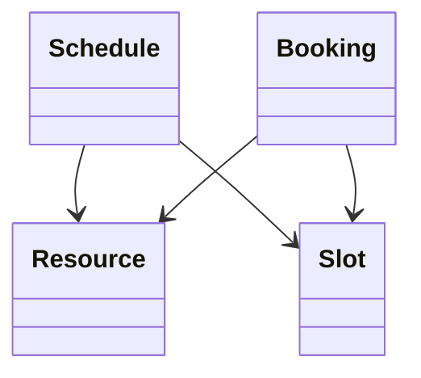
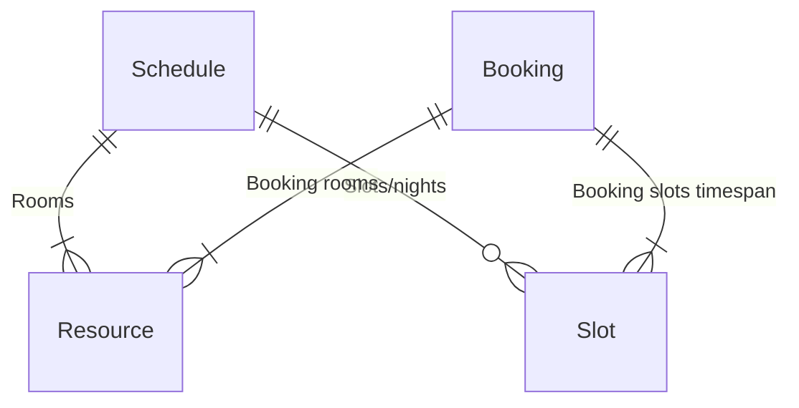
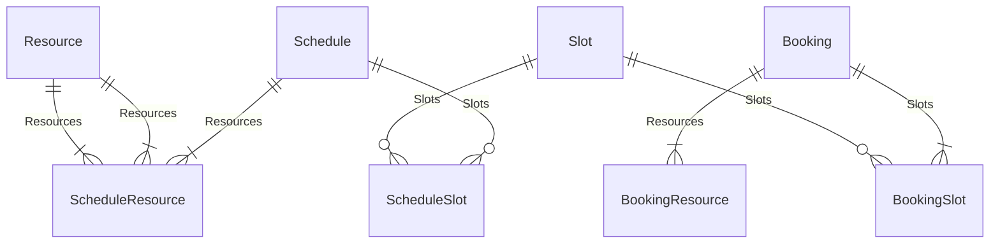
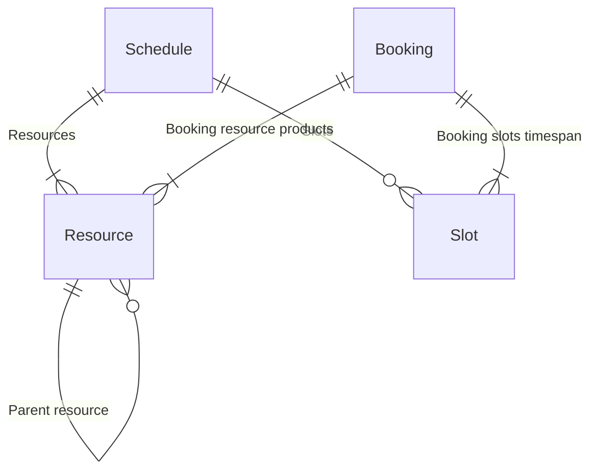

# Code test booking api ticketing api

## Backend Developer Challenge

### Introduction

This technical task is designed to see how you approach a complex problem. We are
looking to understand how you break down your solution, what you consider when you
are making your decisions, how you write and structure code.

We are not necessarily looking for a fully working or a bug free solution. After you
have submitted you will have the opportunity to talk through your approach, what you
found challenging and why you made the decisions you did.

We think that a reasonable solution for discussion could be produced within a few
hours but feel free to spend as long or as short as you like on this.

### Brief

Create a hotel room booking API using ASP.NET Core and Entity Framework (EF) Core,
your solution must be written in C# following RESTful principles.

The solution should be committed to an online repository and access shared with us. 

If you have any supporting documentation, please include this in the repository.

If possible, it should be hosted in an Azure environment (free trials are available),
please note this is not a critical requirement.

Use the database of your choosing.

### Business Rules

- Hotels have 3 room types: single, double, deluxe.
- Hotels have 6 rooms.
- A room cannot be double booked for any given night.
- Any booking at the hotel must not require guests to change rooms at any point
during their stay.
- Booking numbers should be unique. There should not be overlapping at any
given time.
- A room cannot be occupied by more people than its capacity.

### Requirements

The system should provide the following functionality through a well designed API.

#### Business Functionality

Your solution must allow an API consumer to perform the following:

- Find a hotel based on its name.
- Find available rooms between two dates for a given number of people.
- Book a room.
- Find booking details based on a booking reference.

### Technical Requirements

- The API must be testable.
    - OpenAPI / Swagger documentation should be made available for testing.
    - For testing purposes the API should expose functionality to allow for
    seeding and resetting the data:
        - Seeding: Populate database with just enough data for testing.
        - Resetting: Remove all data ready for seeding.
    - Consideration could be given to automated testing but is not essential to
    the deliverable.
- The API requires no authentication.

## Docker 

From repo root folder

```
docker build --platform linux/amd64 --file src/Reserve.Presentation.Api/Dockerfile -t reserve-api:1.0.1 .

docker run -p 8080:80 -it --platform linux/amd64 --name reserve-api reserve-api:1.0.1

az acr build --registry <Name> --image reserve-api:1.0.1 --file src/Reserve.Presentation.Api/Dockerfile . 
```

## Run Application 

From repo root folder

```
dotnet run --project src/Reserve.Presentation.Api
```

```
curl -i -X GET http://localhost:5140
```

Check if seed toggle on 
```
curl -i -X GET http://localhost:5140/data/info 
```

Reset seed data 
```
curl -i -X POST http://localhost:5140/data/reset 
```

Seed data 
```
curl -i -X POST http://localhost:5140/data/seed 
```

Get Hotels

```
curl -X GET http://localhost:5140/hotels | jq  
```

Search hotel name 

```
curl -X GET "http://localhost:5140/hotels/search?name=Grand" | jq
curl -i -X GET "http://localhost:5140/hotels/search?name=Bristol"
curl -i -X GET "http://localhost:5140/hotels/search?name=Nothing"
```

Search hotel availability 

```
curl -X GET "http://localhost:5140/hotels/a1b2c3d4-e5f6-7890-abcd-ef1234567890/rooms/availability-search?from=2026-06-05T15:00:00Z&to=2026-06-06T11:00:00Z&numberofpeople=2" | jq
```

```
curl -X GET "http://localhost:5140/hotels/a1b2c3d4-e5f6-7890-abcd-ef1234567890/rooms/availability-search?from=2026-06-05T15:00:00Z&to=2026-06-06T11:00:00Z&numberofpeople=4" | jq
```

Get hotel bookings 

```
curl -X GET "http://localhost:5140/hotels/a1b2c3d4-e5f6-7890-abcd-ef1234567890/bookings" | jq
```

Book a room

```
curl -i -X POST  -H "Content-Type: application/json"  -d '{"name":"Booking 2", "roomId":"00000000-0000-0000-0000-000000000004", "from":"2026-06-05T15:00:00Z", "to":"2026-06-06T11:00:00Z"}' "http://localhost:5140/hotels/a1b2c3d4-e5f6-7890-abcd-ef1234567890/bookings"
```

```

Get available rooms across hotels 

```
curl -X GET "http://localhost:5140/rooms/availability-search?from=2026-06-05T15:00:00Z&to=2026-06-06T11:00:00Z&numberofpeople=2" | jq
```

Get available rooms across hotels next night

```
curl -X GET "http://localhost:5140/rooms/availability-search?from=2026-06-06T15:00:00Z&to=2026-06-07T11:00:00Z&numberofpeople=2" | jq
```

Get available rooms across weekend

```
curl -X GET "http://localhost:5140/rooms/availability-search?from=2026-06-05T15:00:00Z&to=2026-06-07T11:00:00Z&numberofpeople=2" | jq
```

No rooms for occupants

```
curl -X GET "http://localhost:5140/rooms/availability-search?from=2026-06-05T15:00:00Z&to=2026-06-06T11:00:00Z&numberofpeople=5" | jq
```

Get Booking

```
curl -X GET http://localhost:5140/bookings/2b4161ec-c329-4898-8c7e-3f7234ab9ec9 | jq
```

get new booking 

```
id=297067ad-047a-496e-86c4-920577e4aa7c

curl -X GET "http://localhost:5140/bookings/$id" | jq
```

Open API Swagger APIs 

http://localhost:5140/openapi/v1.json

http://localhost:5140/swagger/index.html

### Run tests 

from ```src``` folder

```
dotnet test Reserve.Core.Test
dotnet test Reserve.Application.Test
dotnet test Reserve.Infrastructure.Data.Test
```

or from repo root 

```
dotnet test
```

## How Application was created 

### Steps 

```
mkdir src
cd src
dotnet new classlib -n Reserve.Core
dotnet new mstest -n Reserve.Core.Test
```

Create Entities classes and starter tests 

Create Api 

```
dotnet new web -n Reserve.Presentation.Api
dotnet new mstest -n Reserve.Presentation.Api.Test 
```

Create Data project 

```
dotnet new classlib -n Reserve.Infrastructure.Data
dotnet new mstest -n Reserve.Infrastructure.Data.Test
```

Create Application project

```
dotnet new classlib -n Reserve.Application
dotnet new mstest -n Reserve.Application.Test
```

Add OpenApi & Swagger to ```Reserve.Presentation.Api``` project 

```
  <ItemGroup>
    <PackageReference Include="Microsoft.AspNetCore.OpenApi" Version="10.0.0" />
    <PackageReference Include="Swashbuckle.AspNetCore" Version="10.0.1" />
  </ItemGroup>
```

### Data structure 

Class Diagram 



Create Entities 



Database Entities 



### Create CQRS classes in Application project 


### Implement Database 


### Implement Api 


### Create Database 

From rep route  

Create migration

```
dotnet ef migrations add CreateDatabase \
  --project src/Reserve.Infrastructure.Data \
  --startup-project src/Reserve.Presentation.Api
```

Create 

```
dotnet ef migrations script  \
  --project src/Reserve.Infrastructure.Data \
  --startup-project src/Reserve.Presentation.Api \
  --verbose \
  --idempotent \ 
  --verbose \
  --output Reserve.Infrastructure.Database\database.sql
```

### Used Claude Code to add Hotel enitiy 

```

```


## Design 

### Using Fhir as a starting point

Resource - This is normally a HealthcareService, Practitioner, Location or Device. In the case where a single resource can provide different services, potentially at different location, then the schedulable resource is considered the composite of the actors. 

Schedule - A container for slots of time that may be available for booking appointments. A schedule controls the dates and times available for the performance of a service and/or the use of a resource.

Slot - A slot of time on a schedule that may be available for booking appointments.

Booking/Appointment - A booking of a healthcare event among patient(s), practitioner(s), related person(s) and/or device(s) for a specific date/time.

Resource
https://build.fhir.org/location.html
https://build.fhir.org/device.html

Schedule
https://build.fhir.org/schedule.html
https://build.fhir.org/schedule-definitions.html#Schedule.actor

Slot 
https://build.fhir.org/slot.html

Appointment
https://build.fhir.org/appointment.html

Workflow 
https://build.fhir.org/workflow-module.html

### Data Model



az group create \
  --name norman-nicolson-hotel \ 
  --location 'UK South' 

az monitor log-analytics workspace create \
  --resource-group norman-nicolson-hotel \
  --workspace-name norman-nicolson-hotel \
  --location 'UK South' 

az monitor log-analytics workspace show \
  --resource-group norman-nicolson-hotel \
  --workspace-name norman-nicolson-hotel| jq .customerId
Get Key for logs-workspace-key

az monitor log-analytics workspace get-shared-keys \
  --resource-group norman-nicolson-hotel \
  --workspace-name norman-nicolson-hotel | jq .primarySharedKey 

az containerapp env create \
  --name norman-nicolson-hotel  \
  --resource-group norman-nicolson-hotel  \
  --location "UK South" 

az containerapp create \
  --name norman-nicolson-hotel  \
  --resource-group norman-nicolson-hotel  \
  --environment norman-nicolson-hotel  \
  --image nlist.azurecr.io/reserve-api:1.0.0 \
  --target-port 80 \
  --ingress external \
  --cpu 0.5 \
  --memory 1.0Gi \
  --min-replicas 0 \
  --max-replicas 1 \
  --query properties.outputs.fqdn

az containerapp identity assign \
  --name norman-nicolson-hotel \
  --resource-group norman-nicolson-hotel \
  --system-assigned

CREATE USER [norman-nicolson-hotel] FROM EXTERNAL PROVIDER WITH OBJECT_ID = '';

ALTER ROLE db_datareader ADD MEMBER [norman-nicolson-hotel];
ALTER ROLE db_datawriter ADD MEMBER [norman-nicolson-hotel];

Server=tcp:<server>.database.windows.net,1433;Database=<db-name>;Authentication=Active Directory Managed Identity;Encrypt=True;

az containerapp revision set-mode \
    --name norman-nicolson-hotel  \
    --resource-group norman-nicolson-hotel  \
    --mode multiple 

az containerapp update \
    --name norman-nicolson-hotel  \
    --resource-group norman-nicolson-hotel  \
    --image nlist.azurecr.io/reserve-api:1.0.1 \
    --revision-suffix "v2"